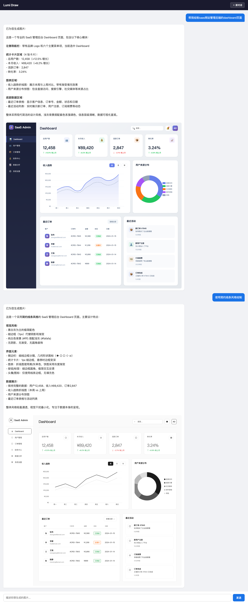

<div align="center">

# Lumi Draw

### Generate Images Without Image Generation Models

**LLM writes code, browser renders pixels — a new paradigm for structured visual content**

[中文文档](README_CN.md) · [Quick Start](#-quick-start) · [Demo Cases](#-demo-cases) · [Architecture](#-architecture)

</div>

---

## Why Lumi Draw?

DALL-E, Midjourney, and Stable Diffusion excel at artistic imagery, but struggle with **structured visual content**:

| Pain Point | Diffusion Models | Lumi Draw |
|------------|-----------------|-----------|
| Layout Control | Trial-and-error prompting, imprecise positioning | Pixel-perfect HTML/CSS layout |
| Text Rendering | Garbled, misspelled, or blurry text | Native browser font rendering, always crisp |
| Data Charts | Cannot produce real data visualizations | ECharts renders actual data |
| Iterative Editing | Must regenerate from scratch each time | Multi-turn incremental editing |
| Reproducibility | Same prompt yields different results | Same code renders identically every time |

**Core insight**: Dashboards, flowcharts, social media cards, infographics, and layout templates are fundamentally **code**, not pixels. Having an LLM write code and rendering it in a browser is the more natural and controllable path.

---

## 🎯 Demo Cases

### Case 1: Social Media Layout → Multi-turn Iteration

> **Turn 1**: `Draw a simple Xiaohongshu (RedNote) layout mockup`
> **Turn 2**: `Use an iPhone as the device frame, remove the background, keep only the phone`

The agent generates a complete Xiaohongshu UI layout, then incrementally modifies the existing code in turn 2 — embedding the layout into an iPhone device frame and removing the background. No regeneration needed.

<p align="center">
  
</p>

### Case 2: SaaS Admin Dashboard

> **Turn 1**: `Build a simple SaaS admin Dashboard page`
> **Turn 2**: `Build a dark-themed professional SaaS admin Dashboard page`

The agent generates a full Dashboard with sidebar navigation, KPI cards, line charts, pie charts, and bar charts in a single turn — data, colors, and layout all production-ready. Turn 2 switches to a dark theme with precise adjustments.

<p align="center">
  
</p>

---

## 🏗 Architecture

```
User Input (natural language)
    │
    ▼
┌─────────────────────────────────┐
│  LangGraph Agent                │
│  ┌───────────────────────────┐  │
│  │ System Prompt (image gen  │  │
│  │   expert)                 │  │
│  │ + Virtual Filesystem (VFS)│  │
│  │ + Middleware Stack         │  │
│  └───────────────────────────┘  │
│            │                    │
│   ┌───────┴────────┐           │
│   ▼                ▼           │
│ Simple task    Complex/multi   │
│ Direct HTML     -turn task     │
│ generation     VFS write+render│
│   │                │           │
│   └───────┬────────┘           │
│           ▼                    │
│  Playwright Headless Chromium   │
│           │                    │
│           ▼                    │
│  VL Quality Check (Qwen3-VL)   │
│  Score < 7? → Auto-fix & retry │
│           │                    │
│           ▼                    │
│     Final PNG Output           │
└─────────────────────────────────┘
```

### Key Technical Innovations

- **HTML Native Agent**: Bypasses intermediate layers like Mermaid/SVG. The LLM generates HTML/CSS/JS directly, rendered by Playwright. Zero conversion loss, full web expressiveness.

- **Dual-mode Rendering Engine**: `pure_css` for static content + `enhanced_web` for dynamic content (ECharts support). Uses `window.__LUMI_RENDER_DONE__` signal for precise screenshot timing.

- **VL Quality Feedback Loop**: After rendering, a vision-language model (Qwen3-VL) scores the output across 4 dimensions: completeness, readability, visual quality, and accuracy. Below threshold? The agent self-corrects and retries (up to 2 times).

- **Virtual Filesystem (VFS)**: In-memory filesystem with `write_file` / `edit_file` / `read_file` operations. Code state persists across conversation turns, enabling true incremental editing.

---

## 🚀 Quick Start

### Local Development

```bash
# 1. Clone
git clone https://github.com/your-username/lumi-draw.git
cd lumi-draw

# 2. Configure
cp .env.example .env
# Edit .env with your LLM API settings

# 3. Install
python -m venv .venv
source .venv/bin/activate
pip install -r requirements.txt
playwright install chromium

# 4. Start backend (port 7700)
uvicorn app.main:app --host 0.0.0.0 --port 7700

# 5. Start frontend in another terminal (port 7800)
python3 frontend/serve.py
```

Open `http://localhost:7800/`

### Docker

```bash
cp .env.example .env
# Edit .env with your config
docker compose up -d --build
```

Open `http://localhost:7800/`

---

## 📡 API Reference

| Method | Endpoint | Description |
|--------|----------|-------------|
| POST | `/api/v1/conversations` | Create a conversation |
| POST | `/api/v1/conversations/{id}/messages` | Send a message (generate image) |
| GET | `/api/v1/conversations/{id}/messages` | Get conversation history |
| GET | `/api/v1/health` | Health check |

**Example: Multi-turn image generation**

```bash
# Create conversation
CID=$(curl -s http://localhost:7700/api/v1/conversations \
  -X POST -H 'Content-Type: application/json' -d '{}' | jq -r '.conversation_id')

# Turn 1: Generate a dashboard
curl -s http://localhost:7700/api/v1/conversations/$CID/messages \
  -X POST -H 'Content-Type: application/json' \
  -d '{"query":"Generate a SaaS admin dashboard with user count, revenue, and order metrics"}'

# Turn 2: Switch to dark theme
curl -s http://localhost:7700/api/v1/conversations/$CID/messages \
  -X POST -H 'Content-Type: application/json' \
  -d '{"query":"Switch to dark theme and refine the color scheme"}'
```

---

## ⚙️ Configuration

| Variable | Description | Default |
|----------|-------------|---------|
| `LLM_PRIMARY_MODEL` | Primary LLM model | `minimax-m21` |
| `LLM_PRIMARY_BASE_URL` | Primary model API URL | - |
| `LLM_PRIMARY_API_KEY` | Primary model API key | - |
| `LLM_PRIMARY_THINKING_ENABLED` | Enable thinking mode | `true` |
| `LLM_PRIMARY_TIMEOUT` | Model timeout (seconds) | `600` |
| `VL_MODEL_URL` | Vision quality check model URL | - |
| `VL_QUALITY_THRESHOLD` | Quality score threshold (0-10) | `7` |
| `RENDER_HTML_MODE` | Render mode | `enhanced_web` |
| `AGENT_ENABLE_VIRTUAL_FILESYSTEM` | Enable virtual filesystem | `true` |
| `LANGFUSE_HOST` | Langfuse tracing URL | - |

See [.env.example](.env.example) for the full list.

---

## 🆚 Comparison

| Feature | Lumi Draw | Diffusion Models | Screenshot Tools |
|---------|-----------|-----------------|-----------------|
| Structured Layout Control | ✅ Pixel-perfect | ❌ Probabilistic | ❌ Manual design |
| Text Rendering | ✅ Always crisp | ❌ Often garbled | ✅ |
| Data Visualization | ✅ Real ECharts data | ❌ Not supported | ❌ Manual |
| Multi-turn Editing | ✅ Incremental | ❌ Full regeneration | ❌ |
| Auto Quality Check | ✅ VL feedback loop | ❌ | ❌ |

---

## 🤝 Contributing

Issues and Pull Requests are welcome.

## 📄 License

[MIT](LICENSE)
